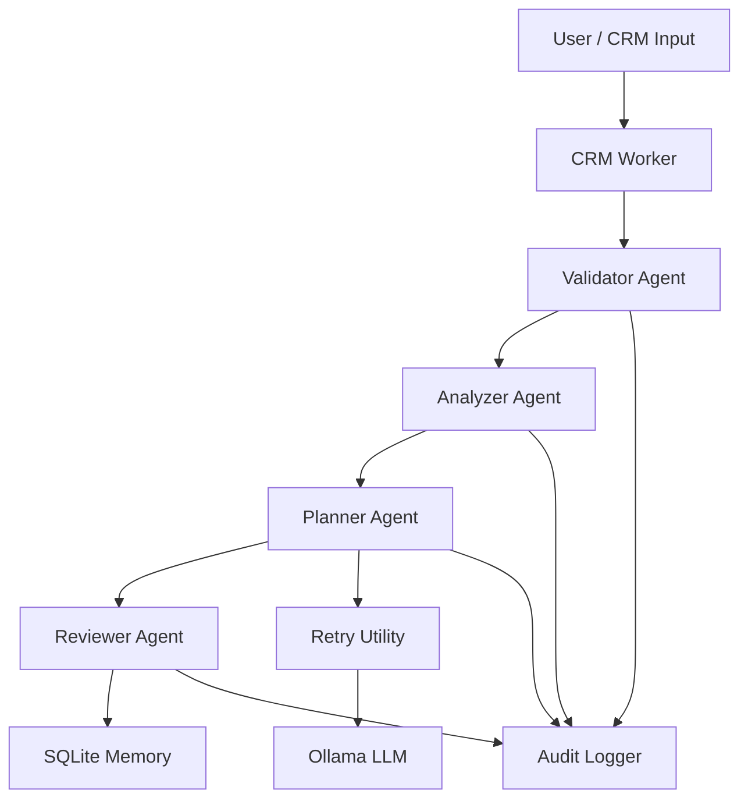

# System Architecture

```mermaid
flowchart TD

    User[User / CRM Input]

    Worker[CRM Worker]

    Validator[Validator Agent]
    Analyzer[Analyzer Agent]
    Planner[Planner Agent]
    Reviewer[Reviewer Agent]

    Ollama[Ollama LLM]
    Retry[Retry Utility]

    Memory[SQLite Memory]
    Logger[Audit Logger]

    User --> Worker

    Worker --> Validator
    Validator --> Analyzer
    Analyzer --> Planner
    Planner --> Reviewer

    Planner --> Retry
    Retry --> Ollama

    Reviewer --> Memory

    Validator --> Logger
    Analyzer --> Logger
    Planner --> Logger
    Reviewer --> Logger

```