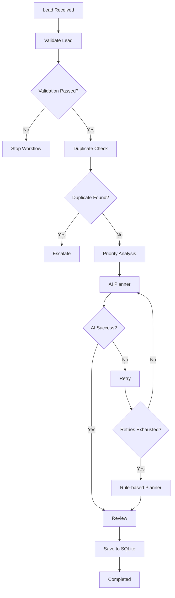

# Workflow Diagram

```mermaid
flowchart TD

A[Lead Received]

B[Validate Lead]

C{Validation Passed?}

D[Stop Workflow]

E[Duplicate Check]

F{Duplicate Found?}

G[Escalate]

H[Priority Analysis]

I[AI Planner]

J{AI Success?}

K[Retry]

L{Retries Exhausted?}

M[Rule-based Planner]

N[Review]

O[Save to SQLite]

P[Completed]

A --> B

B --> C

C -- No --> D

C -- Yes --> E

E --> F

F -- Yes --> G

F -- No --> H

H --> I

I --> J

J -- Yes --> N

J -- No --> K

K --> L

L -- No --> I

L -- Yes --> M

M --> N

N --> O

O --> P

```